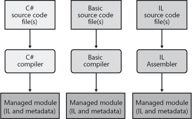
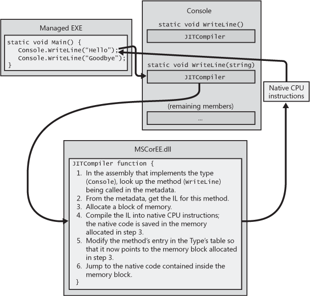

# CLR Execution Model
## Compiling

### Managed Module
* PE32 / PE32+ header:
	* versions requirement
	* type of file: GUI, CUI, DLL
	* timestamp
* CLR header
	* managed module indicator
	* CLR required, flags.
	* MethodDef metadata token
	* location / size of module's metadata, etc
* Metadata
	* Type table
	* Member table
* IL code
	* runtime compilation

### Why Metadata?
* Required of CLR, contains Types & IDLs
* No headers, no libs: Compilers read metadata directly from modules
* Reflections
* Type safe
* Serialize objects
* GC
* C/C++ could except from CLR

## Linker
* Managed modules(IL, metadata) + Resources => CSC/VBC => Assembly(Manifest + IL, metadata + Resources)
* Versions etc.
* No extra dependencies

## Loading CLR
* check CLR
	* Library: MSCorEE.dll
	* Tool: clrver.exe
* check platform versions
	* Tool: dumpbin.exe, corflags.exe
	* and a diagram for different platform
* process creation: 
	* check headers
	* MSCorEE.dll get corresponding libs, initialize CLR
	* load exe assembly
	* call Main

## Executing Assembly
* IL: 
	* cpu dependent
	* obj oriented
	* ILAsm.exe ILDasm.exe
* Call Method:
	* Before: detect types referred, 
	* 1st run of method : refer to the picture
	* 2nd run of mehtod, no MSCorEE.dll part

* JIT compiler:
	* store the native CPU instructions in dynamic memory.
	* double instance when open 2 applications
	* c# compiler for code optimization: 
		* /optimize: control /debug, generate nop for debugger stops
		* /debug: when /optimize-, this will take effect
			* /debug:full, runtime attach support + pdb
			* /debug:pdbonly, pdb symbol file
			* /debug+, 
			* /debug-
* Run
	* unmanaged: just byte code and run
	* IL runtime compile: Performance not drawback, because
		* CPU platform feature used.
		* branch prediction, optimize
		* self-profiling and recompile the IL when app runs ... 
* Get rid of IL runtime compile:
	* Tool: NGen.exe
* System.Runtime.ProfileOptimization:
	* runtime optimization...

## IL and Verification
* IL : stack based, typeless, 
* IL hide CPUs
	* Verification: examine the high level IL and ensure SAFE.
		* check parameter type
		* check return value
		* check return statement
		* address space protection
* Unsafe Code:
	* compile flag: /unsafe
	* System.Security.Permissions.SecurityPermissionFlag = SkipVerification
	* Verification check: PEVerify.exe

## NGen.exe
* build to byte code
	* Improve start time:
	* Reduce application working set: allow code to be shared.
* When native file exist, use native, else, use IL & JIT
* Drawback
	* No intellectual property protection
	* Can get out of sync...
	* a net win.
* Long time startup apps.
	* Managed Profile Guided Optimization tool: MPGO.exe

## Framework Class Library, FCL
* Web Services: ASP.NET XML Web Service / WCF
* Web Forms
* Rich Windows GUI app: WPF, Windows Form
* Console
* Windows Services, Windows Service Control Manager(SCM)
* DB stored procedure: SQL, Oracle, DB2
* Component library

## Common Type System, CTS
Type system Microsoft created itself...

## Common Language Specification, CLS
* CTS + CLS, communication between languages
	* C#, Basic, Fortran: reuse libs in between
* \[assembly: CLSCompliant(true)\]
* [Cross-Language Interoperability](https://msdn.microsoft.com/en-us/library/730f1wy3.aspx?f=255&MSPPError=-2147217396)

## Interoperability with unmanaged code
* Managed -> unmanaged: P/Invoke
* Managed -> COM component: TlbImp.exe
* Unmanaged -> managed: tlbexp.exe, regasm.exe
* [CLRInterop](https://archive.codeplex.com/?p=clrinterop)

