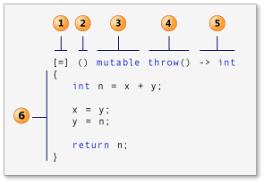

## Basic Lambda

1. Capture Clause
	* (C++14) introduce new variables in body
	* capture by value, capture by reference(&)
	* default capture mode, capture-default
		* [], empty capture clause
		* [&], all variable referred are captured by reference.
			* No other variable can be capture by reference
		* [=], all variable referred are captured by value
			* No other varible can be capture by value
	* Other rules
		* this cannot appear more than once in a capture clause, eg [=, this] is invalid capture clause.
		* Repeated definition is not allowed, eg [i, i] is invalid.
		* [arg...], variadic template
		* [\*this], capture __this__ by value, this is valuable in parallel / async environment, or NUMA environment.
	* Generalized capture(C++14):
		* You can introduce and initialize new vars in capture clause
		* `auto a = [ptr = move(pNums)]{}` 
2. (Optional) Parameter List
	 * accept input parameters
	 * use auto for generic parameter type, template call.
	 * take another lambda as its argument.
3. (Optional) mutable specification
4. (Optional) exception specification
5. (Optional) trailing-return-type
	* can be deduced.
6. Lambda body.
	* Can access: capture variables, parameters, locally-declared vars, class data members, static storage duration variables.

