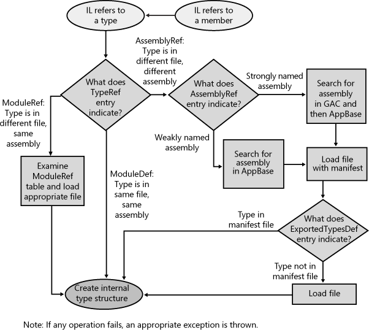

## Two kinds of assemblies, two kind of deplyment
* weakly named assemblies
* strongly named assemblies
	* signed with publisher's public/private key pair
	* could be privately or globally

## Giving Assembly a strong name
* public key
* sn.exe
	* SN -k MyCompany.snk
	* SN-p MyCompany.snk MyCom.PublicKey sha256
	* Show public key SN -tp MyCom.PublicKey
* csc /keyfile:MyCompany.snk Program.csc
* al.exe, hash the content -> FileDef table.
	* /algid: System.Reflection.AssemblyAlgorithmIdAttribute
	* default is SHA-1
* Compile: /references switch

## Global Assembly Cache(GAC)
* Use gacutil.exe to manage it: assembly must be strong!
	* /i, /il: install one or list of assembly
	* /u, /ul: uninstall
	* /l, /lr: list GAC , with or without traced reference
	* /cdl, /ldl: download cache content, clear or list
* prevent using GAC...

## Building Assembly Reference Strongly Named Assembly

## Strongly Named Assembly are Tamper-Resistant
Because of public key.
Series of step that you should follow...

## Privately Deploy Strongly Named Assembly
* codeBase in XML configuration.
	* if codeBase is URL: this is a download cache

## Runtime resolve Type Reference

## Advanced Administrative Control
* using xml configuration file