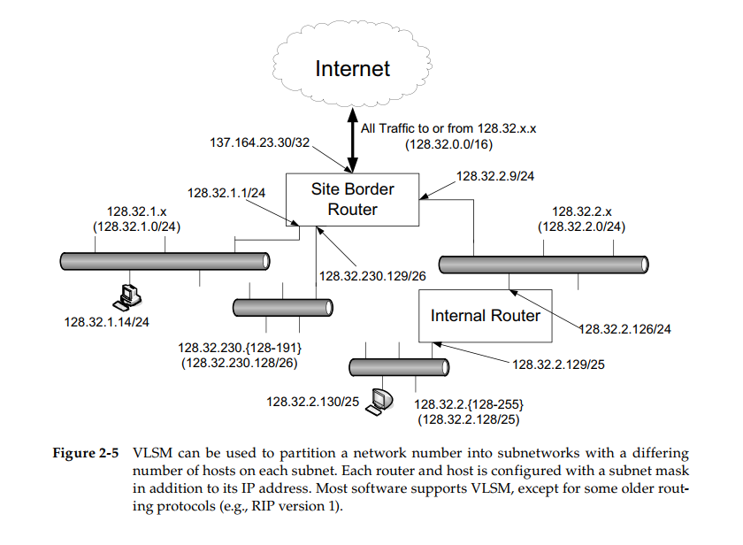

* Introduction
	* IP Address: network layer
	* DNS
	* Allocation of groups of IP address, assign IP to each device. ISP.
* Express IP Addresses
	* IPv4: 4 * 8bit
	* IPv6: 8 * 16bit
		* Leading zero omit.
		* Blocks of zero omit by ::
		* IPv4-mapped IPv6 address: eg ::ffff:10.0.0.1
		* IPv4-compatible IPv6 address: ::1.2.240.1
* Subnet addressing: __RFC0950__
	* 128.32.1.0/24
* Subnet masks
	* used by router and hosts to decide where the network/subnetwork portion ends and the host part begins

|Dotted-Decimal| ShortHand| Binary Representation|
|---|---|---|
|`128.0.0.0`|/1|`1000 0000 0000 0000 0000 0000 0000 0000`|
|`255.0.0.0`|/8|`1111 1111 0000 0000 0000 0000 0000 0000`|
|`ffff:ffff:ffff:ffff::`|/64|`1111 1111 1111 1111 1111 1111 1111 1111 1111 1111 1111 1111 1111 1111 1111 1111 0000 0000 0000 0000 0000 0000 0000 0000 0000 0000 0000 0000 0000 0000 0000 0000`|

* Variable-Length Subnet Masks VLSM
	* address + submask

* Broadcast Addresses
	* Address OR compliment of mask
	* 128.32.1.14/24 OR 0.0.0.255 = 128.32.1.255
	* only IPv4
* IPv6 address and Interface Identifier
	* prefix: scope
	* 

