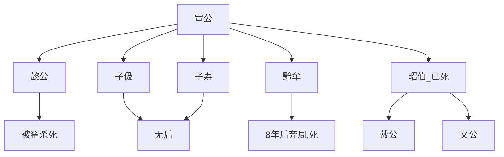

卫康叔
* 名封，周武王同母少弟。再次有冉季。
* 武王伐纣，周公摄政，管蔡之乱后，以武庚殷余民封康叔为卫君，定都故商墟
* 周公旦因为康叔岁数小，申告康叔
	* 依靠贤人，熟读殷朝兴亡，执政要点在于爱民。不要喝酒
	* 尚书·梓材，尚书·康诰，尚书·酒诰
* 成王用事，康叔为周司寇。
* 康叔->康伯（索引按为牟伯）->考伯->嗣伯->𢈻伯->靖伯->贞伯->顷侯

顷侯
* 顷侯贿赂周夷王，周夷王命卫为侯。
	* （索引，康叔初封是侯，后续的伯指方伯，也是侯爵，顷侯贿赂是防止后代削爵）
* [顷侯12年]顷侯卒，子厘侯立

厘侯
* [厘侯13年]周厉王出奔，共和行政
* [厘侯28年]周宣王立
* [厘侯42年]厘侯卒，太子共伯馀立为君
	* 共伯弟弟和有宠于厘侯；然后和养士一起讨伐共伯
	* 共伯钻入厘侯墓道自杀。和立为武公

武公
* 修康叔之政，百姓和集
* [武公42年]犬戎杀周幽王，武公佐周平戎。周平王加封武公为公
* [武公55年]武公卒，子庄公扬立

庄公
* [庄公5年]取齐女，好而无子
	* 又取陈女，生子早死。女弟生子完。完母死，庄公立完为太子。
	* 庄公宠妾生州吁。
	* [庄公18年]州吁长，好兵。石碏谏庄公：乱将生。
	* [庄公23年]庄公卒，太子完立为桓公

桓公
* [桓公2年]州吁骄奢，桓公罢黜州吁，州吁出奔
* [桓公13年]郑伯克段，州吁与段做朋友。
* [桓公16年]州吁收卫逃亡人袭杀桓公。州吁自立。
	* 州吁为段伐郑，请宋、陈、蔡出兵。
	* 石碏为报桓公母家，佯装对州吁好。和陈侯共谋杀死州吁
	* 石碏在邢地迎立桓公弟弟晋，为宣公

宣公
* [宣公7年]鲁人弑君隐公
* [宣公9年]宋督弑君殇公，及孔夫
* [宣公10年]晋曲沃庄伯弑君哀侯
* [宣公18年]宣公爱夫人夷姜，夷姜生子伋，立为太子
	* 太子取齐女，尚未入室，宣公取走。
	* 齐女生子寿，子朔，令左公子为傅
	* 夷姜死，宣公正夫人与朔谗言太子伋。
	* 宣公有代取之事，也要废太子。
	* 阴谋：宣公使伋去齐，持白旄，令盗遮界上杀之。
	* 寿告知伋阴谋，太子不愿逆父。寿盗白旄替死，太子伋向界盗坦白，一并被杀。
	* 朔被立为太子
* [宣公19年]宣公卒，朔立为惠公。

惠公
* [惠公4年]左右公子怨惠公谗杀太子伋代立，作乱使惠公下台。
	* 太子伋弟弟黔牟为君，惠公奔齐

黔牟
* [黔牟8年]齐襄公率诸侯，奉王命伐卫。
	* 纳卫惠公，诛杀左右公子。
	* [惠公13年]黔牟奔周，惠公复立

惠公2
* [惠公25年]惠公因为周纳黔牟，与燕伐周。子颓之乱
	* 惠王奔温，立颓为王。
	* [惠公29年]郑复归惠王
* [惠公31年]惠公卒，子懿公赤立

懿公
* 懿公好鹤，淫乐奢侈。
* [懿公9年]翟伐卫，卫人有叛变的。
	* 大臣：懿公好鹤，为什么不派鹤击翟
	* 翟杀懿公
* 卫人更立黔牟之弟昭伯顽之子申为君，是为戴公

戴公
* [戴公元年]戴公卒。
	* 齐桓公因为卫国政局混乱，率诸侯伐翟。
	* 为卫营造楚丘
	* 立戴公弟毁为卫君，是为文公。
	* 之前卫国内乱，文公奔齐

乱局整理，文公摄政：

文公
* 轻赋平罪，躬耕收民
* [文公16年]晋公子重耳无礼于卫
* [文公17年]齐桓公卒
* [文公25年]文公卒，子成公郑立

成公
* [成公3年]晋假道于卫救宋，成公不许。
	* 晋国从南河渡，救宋。
	* 晋国想要从卫国募兵，成公不肯。
	* 大夫元咺攻成公。
	* 重耳伐卫，分地予宋。（大夫元咺立卫君瑕）
	* 成公奔陈。
	* [成公4年]去周国请求回卫国，和晋文公会谈。
	* 晋文公使人鸩杀成公，成公和毒杀者有旧，毒药分量少，才没有死。
	* 周为成公请晋文公（让卫成公回国），最终成行，诛杀大夫元咺，卫君瑕出奔
* [成公7年]晋文公卒
* [成公12年]成公朝晋襄公。
* [成公14年]秦穆公卒
* [成公26年]齐邴歜弒其君懿公
* [成公35年]成公卒，子穆公遫立

穆公
* [穆公2年]楚庄王伐陈，杀夏徵舒。
* [穆公3年]楚庄王围郑，郑投降，楚庄王从郑撤退。
* [穆公11年]孙良夫救鲁伐齐
	* 穆公卒，定公臧立->[定公12年]定公卒，子献公衎立

献公
* [献公13年]献公令师曹教宫妾鼓琴
	* 妾鼓琴不好，曹鞭打妾。
	* 妾在献公面前朔曹坏话，献公鞭打曹300鞭
* [献公18年]献公约孙文子、宁惠子一起吃饭，二人去后。到了晚上也没有召见
	* 献公去射大雁去了，二人过去找他
	* 献公不脱射服就和二人聊天，二人怒，三人回到宿（孙文子住的地方）。
	* 孙文子劝献公饮酒
	* 师曹奏乐小雅。激怒孙文子，报复卫献公。
	* 孙文子问蘧伯玉献公是故意的吗
	* 伯玉答不知道。孙文子攻打卫献公。
	* 献公奔齐。
	* 孙文子、宁惠子立定公弟弟秋为卫君，为殇公

殇公
* 封孙文子林父于宿
* [殇公12年]宁喜与孙林父争宠
	* 殇公指使宁喜攻孙林父
	* 孙林父奔晋。求迎回卫献公。
	* 献公在齐，孙林父去齐国把卫献公带到晋国，求复辟。
	* 晋伐卫。殇公去晋求和。晋扣押殇公和宁喜，归还献公。

献公后
* [献公后元年]诛杀宁喜。
* [献公后3年]吴国季子过卫。
	* 见蘧伯玉、史鳅而平
	* 听孙林父击磬而悲
	* 献公卒，子襄公恶立

襄公
* [襄公6年]楚灵王会诸侯，襄公称病
* [襄公9年]襄公卒
	* 襄公幸贱妾有身。托梦康叔称元。
	* 立元为嗣，为灵公

灵公
* [灵公5年]朝晋昭公。、
* [灵公6年]楚公子弃疾弑灵王自立为平王
* [灵公11年]大火
* [灵公38年]孔子来，灵公奉孔子。后去而复来
* [灵公39年]太子蒯聩与南子恶
	* 欲杀南子：蒯聩与其徒戏阳遫谋杀南子，戏阳后悔
	* 南子察觉，大声呼号。灵公怒蒯聩，蒯聩奔宋，后奔赵
* [灵公42年]灵公让少子郢陪伴驾车，欲立郢为太子。
	* 郢推辞。
	* 灵公卒，夫人名郢为太子。
	* 郢推蒯聩之子辄为君。为出公

出公
* 赵简子想要趁机送蒯聩回国自立
	* 令阳虎派人从卫国披孝迎蒯聩。赵简子亲自送蒯聩
	* 卫国听闻，发兵阻击。
	* 蒯聩回到宿地自保，卫人停止。
* [出公4年]齐田乞弑君
* [出公8年]齐鲍子弑君悼公
* [出公9年]孔文子问兵于孔子
	* 之前，孔子从陈到卫。
	* 孔子不对
	* 之后鲁迎孔子，孔子不回鲁国。
* [出公12年]孔圉文子取太子蒯聩之姊，生悝
	* 孔家家臣浑良夫长得英俊。孔文子死后，良夫与悝母私通。
	* 太子蒯聩在宿，悝母派良夫到太子处。
	* 太子称如果能让他回国继位，拔擢良夫，免去死罪。
	* 闰月，良夫与太子一起回到卫国。住在孔家外园。
	* 傍晚，两人假扮女子乘车。由宦臣罗驾车，去孔家。
	* 孔氏族老栾宁问起来，说是姻亲家的妾室
	* 于是进入孔家，住在伯姬那里。就是悝母
	* 吃完饭，悝母持戈在前，太子和五名卫士，车上载猪而行。（盟誓之物）
	* 悝母劫孔悝，强行和他约定，劫持悝到卫台召集群臣。
	* 栾宁将饮酒，烤肉都没熟，听说乱起，告知邑宰子路。召唤护驾，乘车吃肉，护送出公奔鲁
	* 仲由将出入孔家，碰到子羔将出孔家。子路第一次不听劝阻。食焉不辟其难
	* 仲由走到门口，碰到公孙敢阖门。第二次不听劝阻。执意平乱
	* 有人出门，子路趁机进去。说：太子不要说劫持孔悝，就是杀死孔悝，也有人会反你。
		* 又说：太子没有勇气。大家把台给烧了，太子就把孔悝放了。
	* 太子派人围攻子路。子路：君子死，冠不免。结缨而死。
	* 孔子听说卫国遭逢大乱。感叹子路大概是死了……
	* 孔悝最后拥立蒯聩，是卫庄公。

庄公
* 上台就要尽诛大臣
* [庄公元年]群臣要作乱，庄公才免了这事
* [庄公2年]孔丘死亡
* [庄公3年]卫戎之战（一笔乱账，下面按照索隐，但是充满故事色彩）
	* 庄公立而背晋（赵），晋伐卫，卫立公子般师（襄公孙子、庄公弟弟）
	* 晋国退兵，庄公再入卫，般师出奔。
	* 庄公见戎州己氏发美，就把她头发全剪下来。
		* 又要讨伐戎州，又驱逐石圃。
	* 石圃攻打庄公。庄公害怕逃跑，误入己氏而被杀。
* 卫国再立公子般师为卫君。
	* 齐国讨伐卫国，再掳走般师
	* 卫国立公子起（灵公的儿子）为卫君

卫君起
* 石圃再次驱逐卫君起，起奔齐。
* 出公从齐国回归自立。
	* 出公12年逃亡，在外4年再次为君。

出公后
* [出公后元年]赏一起逃亡的人。
* [出公后9年]出公卒。出公叔父黔攻打出公儿子，自立，是悼公

悼公、敬公、昭公、怀公、慎公、声公
* [悼公5年]悼公卒，子敬公弗（费）立
* [敬公19年]敬公卒，子昭公纠立
* 三晋强，卫如小侯，属赵。
* [昭公6年]公子亹（wei）弑昭公代立，为怀公
* [怀公11年]公子颓弑怀公代立，为慎公。（慎公父是公子适（系本虔、黔就是悼公））
* [慎公42年]慎公卒，子声公训立
* [声公11年]声公卒，子成侯遬（不逝）立

成侯、平侯、嗣君
* [成侯11年（索隐按：元年）]公孙鞅入秦
* [成侯16年]卫贬号为侯
* [成侯29年]成侯卒，子平侯立
* [平侯8年]平侯卒，子嗣君立
* [嗣君5年]贬号为君，只有濮阳地
* [嗣君42年]嗣君卒，子怀君立

怀君、元君、君角
* [怀君31年]怀君朝魏，魏囚杀怀君
	* 魏立嗣君弟元君，元君娶魏女。
* [元君14年]秦拔魏东地，置东郡
	* 徙卫野王县（约在元君12、13年）
	* 并濮阳卫东郡（约在元君11年）
* [元君25年]元君卒，子君角立。（约在元君23年）
* [君角9年]秦并天下，始皇帝立。
* [君角21年]秦二世废君角为庶人，卫绝祀。

太史公史评
* 宣公太子做事，和晋太子申生差不多。令人悲叹
* 卫到最后，父子相杀，兄弟相灭。* 卫到最后，父子相杀，兄弟相灭。令人慨叹
令人慨叹

